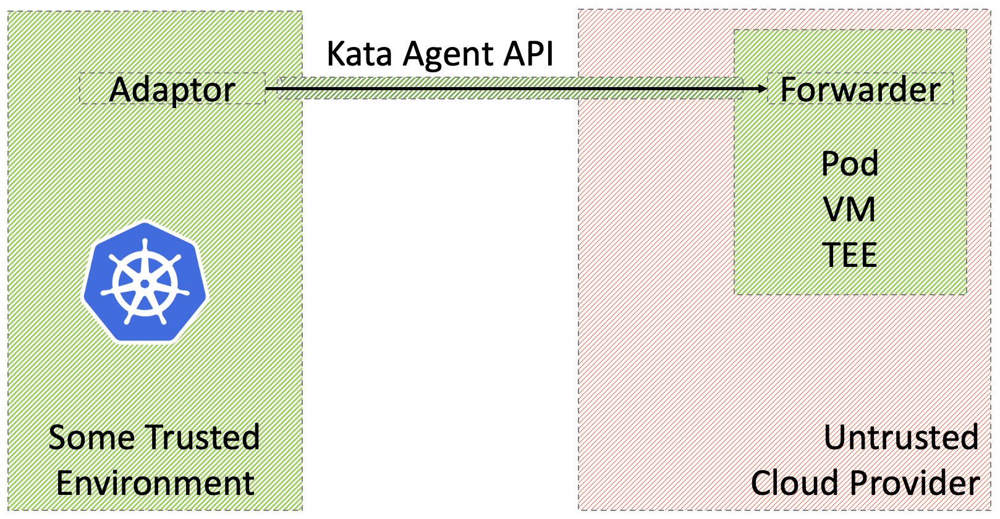

# Secure Peer Pods

This repo prepares ssh tunneling for securing connection between adaptor and forwarder of confidential-computing peer pods.

The repo allows a kuberntes system running in a trusted environment to securly setup and control cloud peer pods across an untrusted network.
All communication is initiated by the trusted environment such that the trused environment is not expected to open any ports and may reside behind a firewall.
The trusted environment may offer different CoCo and Kubernetes services to control and serve peer pods. The kuberntes adaptor in the trusted environment is used to communicate with the peer pod forwarder using an SSH tunnel. 

